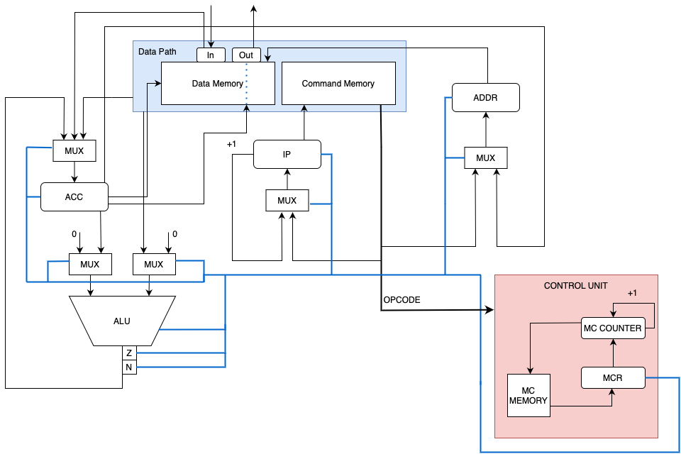

# CSA Lab 3

- Выполнил: Богатов Александр
- Группа: Р33302
- ```asm | acc | harv | mc | tick | struct | stream | port | prob2```

## Язык программирования

```
<program> ::= <section_list> <EOF>
<section_list> ::= <section> <section_list> | <section>
<section> ::= "." <identifier> <EOL> <line_list>
<line_list> ::= <line> <line_list> | <line>
<line> ::= <line_instruction> <EOL> | <EOL>
<line_instruction> ::= <label_decl> | <instruction> | <variable_declaration>
<variable_declaration> ::= <identifier> <type> <letter_or_number_list>
<label_decl> ::= <label> ":"
<label> ::= <identifier>
<identifier> ::= <letter> | <letter> <letter_or_number_list>

<instruction> ::= <no_arg_instr> | <one_arg_instr>
<no_arg_instr> ::= <no_arg_op>
<one_arg_instr> ::= <one_arg_op> <operand>
<operand> ::= <relative_operand> | <abs_operand>
<abs_operand> ::= <label> | <immediate>
<relative_operand> ::= "[" <label> "]"
<immediate> ::= <int_lit> | <char_lit>

<int_lit> ::= <number_list> | "-" <number_list>
<number_list> ::= <number> <number_list> | <number>
<char_lit> ::= "'" <letter> "'" | "'" <number> "'"

<letter_or_number_list> ::= <letter_or_number> | <letter_or_number> <letter_or_number_list>
<letter_or_number> ::= <letter> | <number>

<letter> ::= [a-z] | [A-Z]
<number> ::= [0-9]

<EOF> ::= "1A"
<EOL> ::= "\n"

<type> ::= "STRING" | "NUMERIC" | "CHAR"
<no_arg_op> ::= "inc" | "sh" | "in" | "out" | "hlt"
<one_arg_op> ::= "add" | "ld" | "cmp" | "je" | "jg" | "jmp" | "wr"
```

- В коде asm могут присутствовать 2 секции: .data и .text.

Вне секций объявление данных или код запрещен.
Секция data идет раньше секции text

- Поддерживаются метки. Для обозначения строки как метки, в строке должно быть одно слово и символ ":" в конце.
- Строки ".data:" и ".text:" объявляют секции. На них нельзя ссылаться из кода.

- ac/AC - ссылка на регистр acc - аккумулятор, например:
```
ld [ac]
```

- Данные бывают трех типов: STRING (нуль-терминированные строки), CHAR (символы), NUM (целые числа). Тип должен быть указан после названия переменной. Символы и строки должны быть заключены в двойные кавычки. При записи в память строки разбиваются посимвольно.
- Точка входа в программу - первая инструкция после метки .text

## Организация памяти

- Машинное слово - 32 бита.
- Используется гарвардская архитектура - команды и данные лежат в разных блоках памяти.

### Работа с командами

Регистры:
- acc - аккумулятор
- ip - instruction pointer
- addr - регистр адреса
- z - флаг zero для результата АЛУ
- n - флаг negative для результата АЛУ
- mc_pointer - указатель в память микрокоманд

### Набор инструкций

Все инструкции, требующие участие двух аргументов, берут значение из аккумулятора и из заданной в качестве аргумента ячейки памяти, а после выполняют с ними действия.
Операции, выполняемые по тактам:
- Выборка инструкции (0 такт)
- Выборка адреса (если требуется) и исполнение команды (1 / 1 и 2 такт)
- Изменение ip (2 / 3 такт)

| Синтаксис               | Такты                | Комментарий                                                        |
|:------------------------|:------------------|:-------------------------------------------------------------------| 
| CMP <label>             | 4    | Выполняется как вычитание без записи в acc                         |
| SH                      | 4 | Битовый сдвиг acc                                                  |
| JE <label>              | 3 | Если z=1, ip меняется на адресную часть JE                         |
| JG <label>              | 3 | Если n=1, ip меняется на адресную часть JG                         |
| LD <[ac]/[label]/label> | 3/4 | Адрес операнда или сам операнд записывается в acc                  |
| WR <label>              | 4 | Значение из acc записывается в память                              |
| INC                     | 3 | Значение acc ++                                                    |
| JMP <label>             | 3 | ip меняется на адресную часть JMP                                  |
| ADD <label>             | 4 | Значение acc  += операнд из памяти                                 |
| HLT                     | 3 | Останов                                                            |
| IN                      | 4 | Чтение с устроства ввода  |
| OUT                     | 4 | Запись в устройство вывода |

### Кодирование инструкций

- Код записывается в JSON-файл.

- В этом же списке находятся данные (они лежат перед командами)

- Перед запуском симуляции данные отделяются от кода для симуляции Гарвардской архитектуры

### Память микрокоманд

- Память микрокоманд представляет собой циклическую программу

- Цикл выборки и исполнения инструкций будет продолжаться до тех пор, пока не произойдет ошибка или пока не будет вызвана команда HLT.

| Микрокоманды                                                               | Комментарий |
|:---------------------------------------------------------------------------|:------------------|
| ALU_RIGHT_MUX_ZERO/ALU_RIGHT_MUX_MEM                                       | Сигнал к мультиплексору правого входа АЛУ |
| ALU_LEFT_MUX_ZERO/ALU_LEFT_MUX_ACC                                         | Сигнал к мультиплексору левого входа АЛУ | 
| ALU_SUB/ALU_ADD/ALU_INC/ALU_SH                                             | Сигнал выбора операции АЛУ | 
| ACC_MUX_ALU/ACC_MUX_MEM/ACC_MUX_INPUT                                      | Сигнал к мультиплексору АСС |
| ACC_WRITE                                                                  | Сигнал записи АСС в память | 
| IP_MUX_INC/IP_MUX_INSTR_ADDR_PART                                          | Сигнал к мультиплексору IP | 
| ADDR_MUX_INSTR_ADDR_PART/ADDR_MUX_ACC                                      | Сигнал к мультиплексору ADDR | 
| ACC_LATCH/IP_LATCH/ADDR_LATCH                                              | Сигнал фиксации значений в регистрах | 
| N_SET_GOTO/Z_SET_GOTO/GOTO/CMP_INSTR_NOT_EQ_GOTO/CMP_INSTR_ARG_NOT_EQ_GOTO | Команды перехода в памяти микрокоманд |
| STOP/DECODING_ERR                                                          | Команды останова и ошибки декодирования инструкций |

## Транслятор

- Осуществляется трансляция "на лету": при наличии команд, ссылающихся на еще не определенную метку, эта метка добавляется в словарь зависимостей. Она будет удалена оттуда, как только встретится в коде. Пустой словарь зависимостей - один из признаков успешного завершения трансляции.

Каждая строка в исходном файле может быть:
- пустой (игнорируется)
- меткой
- объявлением секции (особой меткой)
- командой
- объявлением переменной

## Модель процессора



Особенности работы модели:

- Для журнала состояний процессора используется стандартный модуль logging.
- Количество инструкций для моделирования ограничено hardcoded константой.
- Остановка моделирования осуществляется при помощи исключения:
    + StopIteration -- если выполнена инструкция halt.
- Управление симуляцией реализовано в функции simulate.

## Апробация

### Пример работы транслятора:

- Исходный код:
```
.data:
max NUMERIC 4000000
b NUMERIC 1
c NUMERIC 2
d NUMERIC 0
sum NUMERIC 0
zero NUMERIC 0
.text:
loop:
ld [c]
cmp max
jg print_result
ld [sum]
add c
wr sum
cmp max
jg print_result
ld [c]
sh
add b
wr d
ld [d]
add c
add b
wr c
ld [zero]
add d
wr b
jmp loop
print_result:
out
hlt
```
- Результат:
```
[
    4000000,
    1,
    2,
    0,
    0,
    0,
    {
        "opcode": "LD_REL",
        "args": [
            2
        ]
    },
    {
        "opcode": "CMP",
        "args": [
            0
        ]
    },
    {
        "opcode": "JG",
        "args": [
            20
        ]
    },
    {
        "opcode": "LD_REL",
        "args": [
            4
        ]
    },
    {
        "opcode": "ADD",
        "args": [
            2
        ]
    },
    {
        "opcode": "WR",
        "args": [
            4
        ]
    },
    {
        "opcode": "CMP",
        "args": [
            0
        ]
    },
    {
        "opcode": "JG",
        "args": [
            20
        ]
    },
    {
        "opcode": "LD_REL",
        "args": [
            2
        ]
    },
    {
        "opcode": "SH",
        "args": [
            0
        ]
    },
    {
        "opcode": "ADD",
        "args": [
            1
        ]
    },
    {
        "opcode": "WR",
        "args": [
            3
        ]
    },
    {
        "opcode": "LD_REL",
        "args": [
            3
        ]
    },
    {
        "opcode": "ADD",
        "args": [
            2
        ]
    },
    {
        "opcode": "ADD",
        "args": [
            1
        ]
    },
    {
        "opcode": "WR",
        "args": [
            2
        ]
    },
    {
        "opcode": "LD_REL",
        "args": [
            5
        ]
    },
    {
        "opcode": "ADD",
        "args": [
            3
        ]
    },
    {
        "opcode": "WR",
        "args": [
            1
        ]
    },
    {
        "opcode": "JMP",
        "args": [
            0
        ]
    },
    {
        "opcode": "OUT",
        "args": [
            -1
        ]
    },
    {
        "opcode": "HLT",
        "args": []
    }
]
```

### Пример трассировки симуляции
```
DEBUG:root:{TICK: 1, ADDR: 0, IP: 0, ACC: 0, Z: 0, N: 0} IN -1
DEBUG:root:{TICK: 2, ADDR: 0, IP: 0, ACC: M, Z: 0, N: 0} IN -1
DEBUG:root:{TICK: 3, ADDR: 0, IP: 1, ACC: M, Z: 0, N: 0} IN -1
DEBUG:root:{TICK: 4, ADDR: 0, IP: 1, ACC: M, Z: 0, N: 0} CMP 0
DEBUG:root:{TICK: 5, ADDR: 0, IP: 1, ACC: M, Z: 0, N: 0} CMP 0
DEBUG:root:{TICK: 6, ADDR: 0, IP: 1, ACC: M, Z: 0, N: 1} CMP 0
DEBUG:root:{TICK: 7, ADDR: 0, IP: 2, ACC: M, Z: 0, N: 1} CMP 0
DEBUG:root:{TICK: 8, ADDR: 0, IP: 2, ACC: M, Z: 0, N: 1} JE 5
DEBUG:root:{TICK: 9, ADDR: 0, IP: 2, ACC: M, Z: 0, N: 1} JE 5
DEBUG:root:{TICK: 10, ADDR: 0, IP: 3, ACC: M, Z: 0, N: 1} JE 5
DEBUG:root:{TICK: 11, ADDR: 0, IP: 3, ACC: M, Z: 0, N: 1} OUT -1
DEBUG:root:{TICK: 12, ADDR: -1, IP: 3, ACC: M, Z: 0, N: 1} OUT -1
DEBUG:root:{TICK: 13, ADDR: -1, IP: 3, ACC: M, Z: 0, N: 1} OUT -1
DEBUG:root:{TICK: 14, ADDR: -1, IP: 4, ACC: M, Z: 0, N: 1} OUT -1
DEBUG:root:{TICK: 15, ADDR: -1, IP: 4, ACC: M, Z: 0, N: 1} JMP 0
DEBUG:root:{TICK: 16, ADDR: -1, IP: 4, ACC: M, Z: 0, N: 1} JMP 0
DEBUG:root:{TICK: 17, ADDR: -1, IP: 0, ACC: M, Z: 0, N: 1} JMP 0
DEBUG:root:{TICK: 18, ADDR: -1, IP: 0, ACC: M, Z: 0, N: 1} IN -1
DEBUG:root:{TICK: 19, ADDR: -1, IP: 0, ACC: e, Z: 0, N: 1} IN -1
DEBUG:root:{TICK: 20, ADDR: -1, IP: 1, ACC: e, Z: 0, N: 1} IN -1
DEBUG:root:{TICK: 21, ADDR: -1, IP: 1, ACC: e, Z: 0, N: 1} CMP 0
DEBUG:root:{TICK: 22, ADDR: 0, IP: 1, ACC: e, Z: 0, N: 1} CMP 0
DEBUG:root:{TICK: 23, ADDR: 0, IP: 1, ACC: e, Z: 0, N: 1} CMP 0
DEBUG:root:{TICK: 24, ADDR: 0, IP: 2, ACC: e, Z: 0, N: 1} CMP 0
DEBUG:root:{TICK: 25, ADDR: 0, IP: 2, ACC: e, Z: 0, N: 1} JE 5
DEBUG:root:{TICK: 26, ADDR: 0, IP: 2, ACC: e, Z: 0, N: 1} JE 5
DEBUG:root:{TICK: 27, ADDR: 0, IP: 3, ACC: e, Z: 0, N: 1} JE 5
DEBUG:root:{TICK: 28, ADDR: 0, IP: 3, ACC: e, Z: 0, N: 1} OUT -1
DEBUG:root:{TICK: 29, ADDR: -1, IP: 3, ACC: e, Z: 0, N: 1} OUT -1
DEBUG:root:{TICK: 30, ADDR: -1, IP: 3, ACC: e, Z: 0, N: 1} OUT -1
DEBUG:root:{TICK: 31, ADDR: -1, IP: 4, ACC: e, Z: 0, N: 1} OUT -1
DEBUG:root:{TICK: 32, ADDR: -1, IP: 4, ACC: e, Z: 0, N: 1} JMP 0
DEBUG:root:{TICK: 33, ADDR: -1, IP: 4, ACC: e, Z: 0, N: 1} JMP 0
DEBUG:root:{TICK: 34, ADDR: -1, IP: 0, ACC: e, Z: 0, N: 1} JMP 0
DEBUG:root:{TICK: 35, ADDR: -1, IP: 0, ACC: e, Z: 0, N: 1} IN -1
DEBUG:root:{TICK: 36, ADDR: -1, IP: 0, ACC: o, Z: 0, N: 1} IN -1
DEBUG:root:{TICK: 37, ADDR: -1, IP: 1, ACC: o, Z: 0, N: 1} IN -1
DEBUG:root:{TICK: 38, ADDR: -1, IP: 1, ACC: o, Z: 0, N: 1} CMP 0
DEBUG:root:{TICK: 39, ADDR: 0, IP: 1, ACC: o, Z: 0, N: 1} CMP 0
DEBUG:root:{TICK: 40, ADDR: 0, IP: 1, ACC: o, Z: 0, N: 1} CMP 0
DEBUG:root:{TICK: 41, ADDR: 0, IP: 2, ACC: o, Z: 0, N: 1} CMP 0
DEBUG:root:{TICK: 42, ADDR: 0, IP: 2, ACC: o, Z: 0, N: 1} JE 5
DEBUG:root:{TICK: 43, ADDR: 0, IP: 2, ACC: o, Z: 0, N: 1} JE 5
DEBUG:root:{TICK: 44, ADDR: 0, IP: 3, ACC: o, Z: 0, N: 1} JE 5
DEBUG:root:{TICK: 45, ADDR: 0, IP: 3, ACC: o, Z: 0, N: 1} OUT -1
DEBUG:root:{TICK: 46, ADDR: -1, IP: 3, ACC: o, Z: 0, N: 1} OUT -1
DEBUG:root:{TICK: 47, ADDR: -1, IP: 3, ACC: o, Z: 0, N: 1} OUT -1
DEBUG:root:{TICK: 48, ADDR: -1, IP: 4, ACC: o, Z: 0, N: 1} OUT -1
DEBUG:root:{TICK: 49, ADDR: -1, IP: 4, ACC: o, Z: 0, N: 1} JMP 0
DEBUG:root:{TICK: 50, ADDR: -1, IP: 4, ACC: o, Z: 0, N: 1} JMP 0
DEBUG:root:{TICK: 51, ADDR: -1, IP: 0, ACC: o, Z: 0, N: 1} JMP 0
DEBUG:root:{TICK: 52, ADDR: -1, IP: 0, ACC: o, Z: 0, N: 1} IN -1
DEBUG:root:{TICK: 53, ADDR: -1, IP: 0, ACC: w, Z: 0, N: 1} IN -1
DEBUG:root:{TICK: 54, ADDR: -1, IP: 1, ACC: w, Z: 0, N: 1} IN -1
DEBUG:root:{TICK: 55, ADDR: -1, IP: 1, ACC: w, Z: 0, N: 1} CMP 0
DEBUG:root:{TICK: 56, ADDR: 0, IP: 1, ACC: w, Z: 0, N: 1} CMP 0
DEBUG:root:{TICK: 57, ADDR: 0, IP: 1, ACC: w, Z: 0, N: 1} CMP 0
DEBUG:root:{TICK: 58, ADDR: 0, IP: 2, ACC: w, Z: 0, N: 1} CMP 0
DEBUG:root:{TICK: 59, ADDR: 0, IP: 2, ACC: w, Z: 0, N: 1} JE 5
DEBUG:root:{TICK: 60, ADDR: 0, IP: 2, ACC: w, Z: 0, N: 1} JE 5
DEBUG:root:{TICK: 61, ADDR: 0, IP: 3, ACC: w, Z: 0, N: 1} JE 5
DEBUG:root:{TICK: 62, ADDR: 0, IP: 3, ACC: w, Z: 0, N: 1} OUT -1
DEBUG:root:{TICK: 63, ADDR: -1, IP: 3, ACC: w, Z: 0, N: 1} OUT -1
DEBUG:root:{TICK: 64, ADDR: -1, IP: 3, ACC: w, Z: 0, N: 1} OUT -1
DEBUG:root:{TICK: 65, ADDR: -1, IP: 4, ACC: w, Z: 0, N: 1} OUT -1
DEBUG:root:{TICK: 66, ADDR: -1, IP: 4, ACC: w, Z: 0, N: 1} JMP 0
DEBUG:root:{TICK: 67, ADDR: -1, IP: 4, ACC: w, Z: 0, N: 1} JMP 0
DEBUG:root:{TICK: 68, ADDR: -1, IP: 0, ACC: w, Z: 0, N: 1} JMP 0
DEBUG:root:{TICK: 69, ADDR: -1, IP: 0, ACC: w, Z: 0, N: 1} IN -1
DEBUG:root:{TICK: 70, ADDR: -1, IP: 0, ACC:  , Z: 0, N: 1} IN -1
DEBUG:root:{TICK: 71, ADDR: -1, IP: 1, ACC:  , Z: 0, N: 1} IN -1
DEBUG:root:{TICK: 72, ADDR: -1, IP: 1, ACC:  , Z: 0, N: 1} CMP 0
DEBUG:root:{TICK: 73, ADDR: 0, IP: 1, ACC:  , Z: 0, N: 1} CMP 0
DEBUG:root:{TICK: 74, ADDR: 0, IP: 1, ACC:  , Z: 0, N: 1} CMP 0
DEBUG:root:{TICK: 75, ADDR: 0, IP: 2, ACC:  , Z: 0, N: 1} CMP 0
DEBUG:root:{TICK: 76, ADDR: 0, IP: 2, ACC:  , Z: 0, N: 1} JE 5
DEBUG:root:{TICK: 77, ADDR: 0, IP: 2, ACC:  , Z: 0, N: 1} JE 5
DEBUG:root:{TICK: 78, ADDR: 0, IP: 3, ACC:  , Z: 0, N: 1} JE 5
DEBUG:root:{TICK: 79, ADDR: 0, IP: 3, ACC:  , Z: 0, N: 1} OUT -1
DEBUG:root:{TICK: 80, ADDR: -1, IP: 3, ACC:  , Z: 0, N: 1} OUT -1
DEBUG:root:{TICK: 81, ADDR: -1, IP: 3, ACC:  , Z: 0, N: 1} OUT -1
DEBUG:root:{TICK: 82, ADDR: -1, IP: 4, ACC:  , Z: 0, N: 1} OUT -1
DEBUG:root:{TICK: 83, ADDR: -1, IP: 4, ACC:  , Z: 0, N: 1} JMP 0
DEBUG:root:{TICK: 84, ADDR: -1, IP: 4, ACC:  , Z: 0, N: 1} JMP 0
DEBUG:root:{TICK: 85, ADDR: -1, IP: 0, ACC:  , Z: 0, N: 1} JMP 0
DEBUG:root:{TICK: 86, ADDR: -1, IP: 0, ACC:  , Z: 0, N: 1} IN -1
DEBUG:root:{TICK: 87, ADDR: -1, IP: 0, ACC: m, Z: 0, N: 1} IN -1
DEBUG:root:{TICK: 88, ADDR: -1, IP: 1, ACC: m, Z: 0, N: 1} IN -1
DEBUG:root:{TICK: 89, ADDR: -1, IP: 1, ACC: m, Z: 0, N: 1} CMP 0
DEBUG:root:{TICK: 90, ADDR: 0, IP: 1, ACC: m, Z: 0, N: 1} CMP 0
DEBUG:root:{TICK: 91, ADDR: 0, IP: 1, ACC: m, Z: 0, N: 1} CMP 0
DEBUG:root:{TICK: 92, ADDR: 0, IP: 2, ACC: m, Z: 0, N: 1} CMP 0
DEBUG:root:{TICK: 93, ADDR: 0, IP: 2, ACC: m, Z: 0, N: 1} JE 5
DEBUG:root:{TICK: 94, ADDR: 0, IP: 2, ACC: m, Z: 0, N: 1} JE 5
DEBUG:root:{TICK: 95, ADDR: 0, IP: 3, ACC: m, Z: 0, N: 1} JE 5
DEBUG:root:{TICK: 96, ADDR: 0, IP: 3, ACC: m, Z: 0, N: 1} OUT -1
DEBUG:root:{TICK: 97, ADDR: -1, IP: 3, ACC: m, Z: 0, N: 1} OUT -1
DEBUG:root:{TICK: 98, ADDR: -1, IP: 3, ACC: m, Z: 0, N: 1} OUT -1
DEBUG:root:{TICK: 99, ADDR: -1, IP: 4, ACC: m, Z: 0, N: 1} OUT -1
DEBUG:root:{TICK: 100, ADDR: -1, IP: 4, ACC: m, Z: 0, N: 1} JMP 0
DEBUG:root:{TICK: 101, ADDR: -1, IP: 4, ACC: m, Z: 0, N: 1} JMP 0
DEBUG:root:{TICK: 102, ADDR: -1, IP: 0, ACC: m, Z: 0, N: 1} JMP 0
DEBUG:root:{TICK: 103, ADDR: -1, IP: 0, ACC: m, Z: 0, N: 1} IN -1
DEBUG:root:{TICK: 104, ADDR: -1, IP: 0, ACC: e, Z: 0, N: 1} IN -1
DEBUG:root:{TICK: 105, ADDR: -1, IP: 1, ACC: e, Z: 0, N: 1} IN -1
DEBUG:root:{TICK: 106, ADDR: -1, IP: 1, ACC: e, Z: 0, N: 1} CMP 0
DEBUG:root:{TICK: 107, ADDR: 0, IP: 1, ACC: e, Z: 0, N: 1} CMP 0
DEBUG:root:{TICK: 108, ADDR: 0, IP: 1, ACC: e, Z: 0, N: 1} CMP 0
DEBUG:root:{TICK: 109, ADDR: 0, IP: 2, ACC: e, Z: 0, N: 1} CMP 0
DEBUG:root:{TICK: 110, ADDR: 0, IP: 2, ACC: e, Z: 0, N: 1} JE 5
DEBUG:root:{TICK: 111, ADDR: 0, IP: 2, ACC: e, Z: 0, N: 1} JE 5
DEBUG:root:{TICK: 112, ADDR: 0, IP: 3, ACC: e, Z: 0, N: 1} JE 5
DEBUG:root:{TICK: 113, ADDR: 0, IP: 3, ACC: e, Z: 0, N: 1} OUT -1
DEBUG:root:{TICK: 114, ADDR: -1, IP: 3, ACC: e, Z: 0, N: 1} OUT -1
DEBUG:root:{TICK: 115, ADDR: -1, IP: 3, ACC: e, Z: 0, N: 1} OUT -1
DEBUG:root:{TICK: 116, ADDR: -1, IP: 4, ACC: e, Z: 0, N: 1} OUT -1
DEBUG:root:{TICK: 117, ADDR: -1, IP: 4, ACC: e, Z: 0, N: 1} JMP 0
DEBUG:root:{TICK: 118, ADDR: -1, IP: 4, ACC: e, Z: 0, N: 1} JMP 0
DEBUG:root:{TICK: 119, ADDR: -1, IP: 0, ACC: e, Z: 0, N: 1} JMP 0
DEBUG:root:{TICK: 120, ADDR: -1, IP: 0, ACC: e, Z: 0, N: 1} IN -1
DEBUG:root:{TICK: 121, ADDR: -1, IP: 0, ACC: o, Z: 0, N: 1} IN -1
DEBUG:root:{TICK: 122, ADDR: -1, IP: 1, ACC: o, Z: 0, N: 1} IN -1
DEBUG:root:{TICK: 123, ADDR: -1, IP: 1, ACC: o, Z: 0, N: 1} CMP 0
DEBUG:root:{TICK: 124, ADDR: 0, IP: 1, ACC: o, Z: 0, N: 1} CMP 0
DEBUG:root:{TICK: 125, ADDR: 0, IP: 1, ACC: o, Z: 0, N: 1} CMP 0
DEBUG:root:{TICK: 126, ADDR: 0, IP: 2, ACC: o, Z: 0, N: 1} CMP 0
DEBUG:root:{TICK: 127, ADDR: 0, IP: 2, ACC: o, Z: 0, N: 1} JE 5
DEBUG:root:{TICK: 128, ADDR: 0, IP: 2, ACC: o, Z: 0, N: 1} JE 5
DEBUG:root:{TICK: 129, ADDR: 0, IP: 3, ACC: o, Z: 0, N: 1} JE 5
DEBUG:root:{TICK: 130, ADDR: 0, IP: 3, ACC: o, Z: 0, N: 1} OUT -1
DEBUG:root:{TICK: 131, ADDR: -1, IP: 3, ACC: o, Z: 0, N: 1} OUT -1
DEBUG:root:{TICK: 132, ADDR: -1, IP: 3, ACC: o, Z: 0, N: 1} OUT -1
DEBUG:root:{TICK: 133, ADDR: -1, IP: 4, ACC: o, Z: 0, N: 1} OUT -1
DEBUG:root:{TICK: 134, ADDR: -1, IP: 4, ACC: o, Z: 0, N: 1} JMP 0
DEBUG:root:{TICK: 135, ADDR: -1, IP: 4, ACC: o, Z: 0, N: 1} JMP 0
DEBUG:root:{TICK: 136, ADDR: -1, IP: 0, ACC: o, Z: 0, N: 1} JMP 0
DEBUG:root:{TICK: 137, ADDR: -1, IP: 0, ACC: o, Z: 0, N: 1} IN -1
DEBUG:root:{TICK: 138, ADDR: -1, IP: 0, ACC: w, Z: 0, N: 1} IN -1
DEBUG:root:{TICK: 139, ADDR: -1, IP: 1, ACC: w, Z: 0, N: 1} IN -1
DEBUG:root:{TICK: 140, ADDR: -1, IP: 1, ACC: w, Z: 0, N: 1} CMP 0
DEBUG:root:{TICK: 141, ADDR: 0, IP: 1, ACC: w, Z: 0, N: 1} CMP 0
DEBUG:root:{TICK: 142, ADDR: 0, IP: 1, ACC: w, Z: 0, N: 1} CMP 0
DEBUG:root:{TICK: 143, ADDR: 0, IP: 2, ACC: w, Z: 0, N: 1} CMP 0
DEBUG:root:{TICK: 144, ADDR: 0, IP: 2, ACC: w, Z: 0, N: 1} JE 5
DEBUG:root:{TICK: 145, ADDR: 0, IP: 2, ACC: w, Z: 0, N: 1} JE 5
DEBUG:root:{TICK: 146, ADDR: 0, IP: 3, ACC: w, Z: 0, N: 1} JE 5
DEBUG:root:{TICK: 147, ADDR: 0, IP: 3, ACC: w, Z: 0, N: 1} OUT -1
DEBUG:root:{TICK: 148, ADDR: -1, IP: 3, ACC: w, Z: 0, N: 1} OUT -1
DEBUG:root:{TICK: 149, ADDR: -1, IP: 3, ACC: w, Z: 0, N: 1} OUT -1
DEBUG:root:{TICK: 150, ADDR: -1, IP: 4, ACC: w, Z: 0, N: 1} OUT -1
DEBUG:root:{TICK: 151, ADDR: -1, IP: 4, ACC: w, Z: 0, N: 1} JMP 0
DEBUG:root:{TICK: 152, ADDR: -1, IP: 4, ACC: w, Z: 0, N: 1} JMP 0
DEBUG:root:{TICK: 153, ADDR: -1, IP: 0, ACC: w, Z: 0, N: 1} JMP 0
DEBUG:root:{TICK: 154, ADDR: -1, IP: 0, ACC: w, Z: 0, N: 1} IN -1
DEBUG:root:{TICK: 155, ADDR: -1, IP: 0, ACC: , Z: 0, N: 1} IN -1
DEBUG:root:{TICK: 156, ADDR: -1, IP: 1, ACC: , Z: 0, N: 1} IN -1
DEBUG:root:{TICK: 157, ADDR: -1, IP: 1, ACC: , Z: 0, N: 1} CMP 0
DEBUG:root:{TICK: 158, ADDR: 0, IP: 1, ACC: , Z: 0, N: 1} CMP 0
DEBUG:root:{TICK: 159, ADDR: 0, IP: 1, ACC: , Z: 1, N: 0} CMP 0
DEBUG:root:{TICK: 160, ADDR: 0, IP: 2, ACC: , Z: 1, N: 0} CMP 0
DEBUG:root:{TICK: 161, ADDR: 0, IP: 2, ACC: , Z: 1, N: 0} JE 5
DEBUG:root:{TICK: 162, ADDR: 0, IP: 2, ACC: , Z: 1, N: 0} JE 5
DEBUG:root:{TICK: 163, ADDR: 0, IP: 5, ACC: , Z: 1, N: 0} JE 5
DEBUG:root:{TICK: 164, ADDR: 0, IP: 5, ACC: , Z: 1, N: 0} HLT no arg
DEBUG:root:{TICK: 165, ADDR: 0, IP: 5, ACC: , Z: 1, N: 0} HLT no arg
DEBUG:root:{TICK: 166, ADDR: 0, IP: 5, ACC: , Z: 1, N: 0} HLT no arg
DEBUG:root:Iteration stopped by HLT
```

Папки с...
- [Исходниками](https://gitlab.se.ifmo.ru/albogatov/csa-lab-3/-/tree/master/asm_src)
- [Результатами работы транслятора](https://gitlab.se.ifmo.ru/albogatov/csa-lab-3/-/tree/master/code)
- [Входными данными для симуляции](https://gitlab.se.ifmo.ru/albogatov/csa-lab-3/-/tree/master/io)

| ФИО            | алг.  | LoC (в строках) | code байт | code инстр | инстр. | такт. | вариант |
|:---------------|:------|:----------------| :---|:-----------|:-------|:------| :---| 
| Богатов А.С.   | hello | 18              | -| 26         | 110    | 398   | asm | 
| Богатов А.С.  | cat   | 11              | -| 7          | 49     | 166   | asm | 
| Богатов А.С.  | prob2 | 32              | -| 28         | 210     | 807   | asm | 


